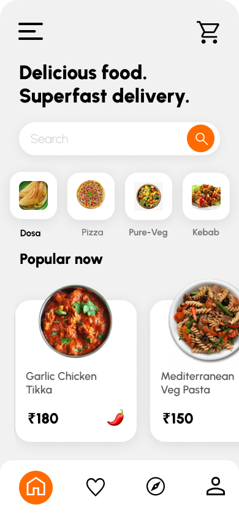

## SimpleFood2 (Kotlin Multiplatform + Compose Multiplatform)

This project is a Kotlin Multiplatform (KMP) app targeting Android and iOS using Compose Multiplatform for a shared UI.

- **Design source**: [Figma – Simple_Food2](https://www.figma.com/design/RICuRI2XnLG4SHmLFAKTKl/Simple_Food2?node-id=1-11)



### Project structure
- **`composeApp`**: KMP module with shared UI and platform code
  - `src/commonMain/kotlin/com/example/simplefood2/App.kt`: Single-file UI implementation (theme + screen)
  - `src/commonMain/composeResources/drawable`: Shared resources (images, vector XML icons)
  - `src/androidMain/kotlin/.../MainActivity.kt`: Android entry point
  - `src/iosMain/kotlin/.../MainViewController.kt`: iOS entry point used by `iosApp`
- **`iosApp/iosApp`**: iOS SwiftUI app embedding Compose via `MainViewController()`

### Implemented screen (from Figma)
`App.kt` reproduces the "iPhone 14 - 1" frame:
- Top bar with hamburger and cart
- Title: "Delicious food. Superfast delivery."
- Search bar with orange circular action
- Horizontal categories
- "Popular now" product cards with price/add icon
- Bottom pill with 4 icons: `ic_home`, `ic_collect`, `ic_compass`, `ic_profile`

### Resources
Current assets in `composeApp/src/commonMain/composeResources/drawable`:
- Categories: `category_dosa.png`, `category_pizza.png`, `category_pure_veg.png`, `category_kebab.png`
- Products: `product_garlic_chicken_tikka.png`, `product_mediterranean_veg_pasta.png`
- Icons (XML vectors): `ic_add.xml` (add), `ic_search.xml`, `ic_shopping_cart.xml`, `ic_home.xml`, `ic_collect.xml`, `ic_compass.xml`, `ic_profile.xml`

Guidelines:
- **Icons**: export from Figma as SVG, convert to Android Vector Drawable XML, and place in `drawable/`
- **Images/avatars**: export as PNG and place in `drawable/`
- **Naming**: `ic_*` for icons, `category_*` and `product_*` for images

### Build & run
Prerequisites: JDK 11+, Android SDK, Android Studio Koala or newer, Xcode 15+ for iOS.

- Android (assemble and run):
```bash
./gradlew :composeApp:assembleDebug
```
Run the `composeApp` Android configuration (launches `MainActivity`).

- iOS (open in Xcode):
1) Open `iosApp/iosApp.xcodeproj` in Xcode
2) Select a simulator and run (uses `MainViewController()` from shared code)

### Development workflow
- UI lives entirely in `App.kt` for simplicity (theme + composables in one place)
- To preview quickly, use Android Studio @Preview for `App()`
- To adjust spacing/typography to match Figma, tweak constants in `App.kt` (sizes, paddings, weights)

### Updating assets from Figma
1) Export icons as SVG from the "Nan @" frame (bottom pill)
2) Convert SVG to Vector XML (or author XML directly) and save as `ic_home.xml`, `ic_collect.xml`, `ic_compass.xml`, `ic_profile.xml`
3) Export raster images (categories/products) as PNGs and place in `drawable/`
4) Reference via `Res.drawable.*` in `App.kt`

### Troubleshooting
- iOS build tasks can be slow/fragile on CI; for quick checks on Android use:
```bash
./gradlew :composeApp:compileDebugKotlinAndroid
```
- If a resource cannot be found, confirm the filename in `drawable/` and the symbol in `Res.drawable.*`
- Clear Gradle caches if needed:
```bash
./gradlew --stop
./gradlew clean
```

### Links
- Compose Multiplatform docs: https://www.jetbrains.com/help/kotlin-multiplatform-dev/get-started.html